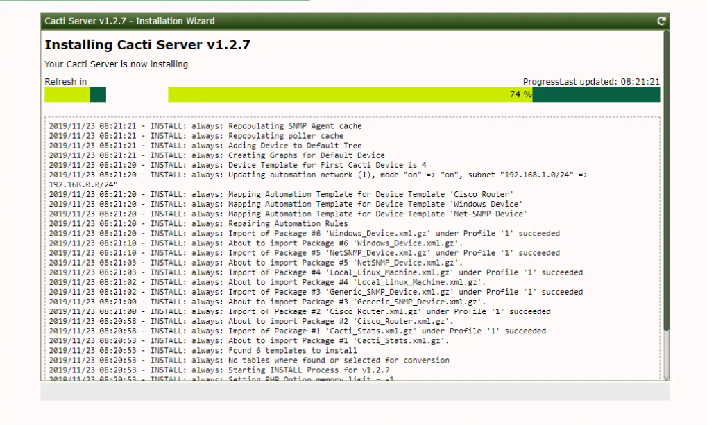
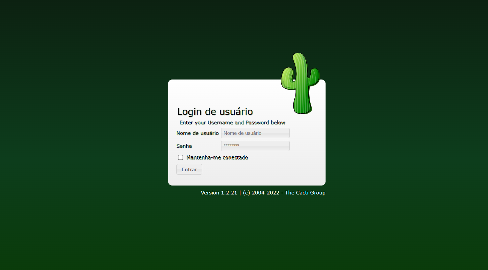
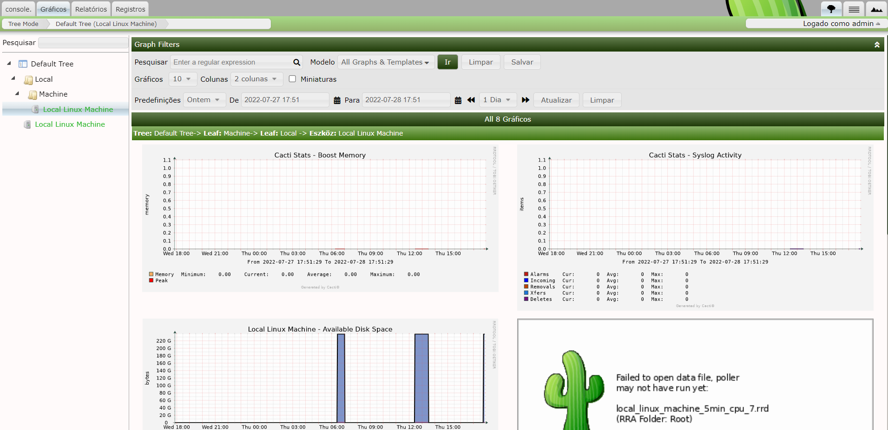

# CACTI

Cacti is a robust performance and fault operation frame and a frontend to RRDTool- a Time Series Database( TSDB). It stores all of the necessary information to produce performance operation Graphs in either MariaDB or MySQL, and also leverages its colorful Data Collectors to colonize RRDTool grounded TSDB with that performance data.

Cacti is additionally a LAMP stack Web Application. The term LAMP originally stood for Linux, Apache, MySQL and PHP but over the years the term has evolved. Cacti is now additionally supported on Windows, it has the ability to use Nginx or IIS as its Web Server, and MariaDB is now the default database on various Linux platforms. The key conception of the LAMP stack continues to be consistent. Structural information is stored in the relational database, Time Series information is stored in RRDTool's Round Robin Archives (RRA), and the Web Web page is ultimately guided by PHP.

## Installation In WSL

Update the repository with *apt*
```bash
sudo apt update
```

Install *apache2* && *MariaDB* && lib *php-mysql*
```bash
sudo apt install -y apache2 mariadb-server mariadb-client php-mysql libapache2-mod-php
```

Extensions for operation **php <--> cacti**
```bash
sudo apt install -y php-xml php-ldap php-mbstring php-gd php-gmp
```

Install the SNMP and RRDtool on the server in case you want to monitor the Cacti server as well
```bash
sudo apt install -y snmp php-snmp rrdtool librrds-perl
```

For better performances... Edit the configuration file:
```
sudo nano /etc/mysql/mariadb.conf.d/50-server.cnf
```
```
collation-server = utf8mb4_unicode_ci
max_heap_table_size = 128M
tmp_table_size = 64M
join_buffer_size = 64M
innodb_file_format = Barracuda
innodb_large_prefix = 1
innodb_buffer_pool_size = 512M
innodb_flush_log_at_timeout = 3
innodb_read_io_threads = 32
innodb_write_io_threads = 16
innodb_io_capacity = 5000
innodb_io_capacity_max = 10000
```

Set a timezone in php.ini (in apache2 and php.ini) (access folder of your version php)
```
sudo nano /etc/php/VERSION_PHP/apache2/php.ini
```
**AND**
```
sudo nano /etc/php/VERSION_PHP/cli/php.ini
```
**TO**
```
date.timezone = America/Sao_Paulo
memory_limit = 512M
max_execution_time = 60
```

Restart the MariaDB
```
sudo systemctl restart mariadb
```

## Create the Database

Log in MariaDB with:
```
sudo mysql -u root -p
```

Create the database for the Cacti
```
create database cacti;
```

Concede permissions to localhost cacti by user password
```
GRANT ALL ON cacti.* TO cactiuser@localhost IDENTIFIED BY 'cactipassword';

FLUSH PRIVILEGES;

EXIT
```

Now, download and configure Cacti
```
wget https://www.cacti.net/downloads/cacti-latest.tar.gz
```

Extract files and move of the respective directory
```
tar -zxvf cacti-latest.tar.gz

sudo mv cacti-1* /opt/cacti
```

Import the default Cacti DATABASE for MariaDB
```
sudo mysql -u root -p cacti < /opt/cacti/cacti.sql
```

Edit the file config.php in folder of the Cacti
```
sudo nano /opt/cacti/include/config.php
```

```
// verify your configuration (pattern)

$database_type = "mysql";
$database_default = "cacti";
$database_hostname = "localhost";
$database_username = "cactiuser";
$database_password = "cactipassword";
$database_port = "3306";
$database_ssl = false;
```

Add cron file job for pooling Cacti
```
sudo nano /etc/cron.d/cacti
```

Make scheduler in cron job pooling (run every five minutes)
```
*/5 * * * * www-data php /opt/cacti/poller.php > /dev/null 2>&1
```

## Configuration Apache
Create new conf in apache for Cacti
```
sudo nano /etc/apache2/sites-available/cacti.conf
```

Configuration of the file
```
Alias /cacti /opt/cacti

  <Directory /opt/cacti>
      Options +FollowSymLinks
      AllowOverride None
      <IfVersion >= 2.3>
      Require all granted
      </IfVersion>
      <IfVersion < 2.3>
      Order Allow,Deny
      Allow from all
      </IfVersion>

   AddType application/x-httpd-php .php

<IfModule mod_php.c>
      php_flag magic_quotes_gpc Off
      php_flag short_open_tag On
      php_flag register_globals Off
      php_flag register_argc_argv On
      php_flag track_vars On
      # this setting is necessary for some locales
      php_value mbstring.func_overload 0
      php_value include_path .
 </IfModule>

  DirectoryIndex index.php
</Directory>
```

Enable the configuration site Cacti
```
sudo a2ensite cacti
```

Restart Apache Service
```
sudo systemctl restart apache2
```

### BONUS...
Create file log Cacti and permission to Apache user write
```
sudo touch /opt/cacti/log/cacti.log

sudo chown -R www-data:www-data /opt/cacti/
```

#### Access in: http://your_ip_address/cacti

<hr>

## Process of install Cacti


<hr>

### After... Log in the Cacti controll


<hr>

### Visualize Graphs of the Cacti

